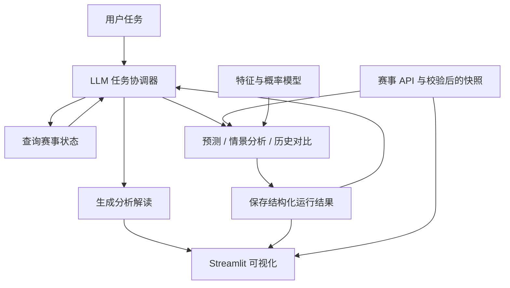

# World Cup Prediction Agent

**由 LLM 协调、统计模型驱动的世界杯预测与赛事分析系统。**

围绕赛前冠军预测、赛事状态查询和情景推演，整合真实比赛数据、概率模型、赛事模拟与自然语言解读，提供可追溯的分析结果和交互式可视化界面。

[快速开始](#快速开始) · [Agent 工作流](#agent-工作流) · [模型与评估](#模型与评估) · [部署指南](docs/deployment.md) · [API 文档](docs/api-v2.md)

## 核心能力

| 能力 | 说明 |
| --- | --- |
| 冠军概率预测 | 模拟完整赛事，输出各队夺冠概率、各轮晋级概率与决赛配对分布 |
| 真实赛事同步 | 通过 API-Football 与 football-data.org 获取权限范围内的赛程、状态和比分 |
| Agent 任务协调 | LLM 理解任务、选择业务工具、读取执行结果并决定后续步骤 |
| 情景推演 | 指定比赛晋级假设，与同一随机种子的基线结果对比 |
| 历史结果对比 | 对比已保存运行，追踪数据快照与模型版本 |
| 预测解读 | LLM 根据结构化模型证据生成中文分析，支持缓存与明确的失败降级 |
| 可视化界面 | 展示冠军概率、真实淘汰赛路线、分析内容和情景沙盘 |

**展示约定：** 首页冠军卡片使用截至 **2026 年 6 月 1 日** 的赛前预测快照；淘汰赛路线独立展示赛事接口记录。预测概率、模拟路径与实际赛果分别处理。未获取到真实数据时，不用模拟结果填充实际赛程。

## Agent 工作流

LLM 是任务协调者：它负责理解请求、规划步骤并调用工具。预测工具运行特征计算、概率模型和赛事模拟，再把结构化结果返回给 LLM。解读基于这些结果生成，模型权重与概率计算由预测引擎管理。



协调器可以调用五个业务工具：

| 工具 | 职责 |
| --- | --- |
| `query_tournament_state` | 查询数据快照、赛事状态和已有运行 |
| `run_prediction_workflow` | 按任务要求刷新数据或使用指定快照，执行完整预测 |
| `run_scenario_workflow` | 执行晋级假设及对应基线计算 |
| `compare_historical_results` | 对比已保存的预测结果 |
| `generate_explanation` | 根据指定运行的模型证据调用 LLM 生成解读 |

每次协调最多进行 6 步、每步调用一个工具，并限制为一次预测或情景计算。工具输入由后端契约校验，调用受额度和任务占用控制。

首页读取已保存的预测，并单独获取该结果的 LLM 解读；点击预测或情景操作时才执行对应工作流。命中解释缓存不代表再次调用 LLM。生成失败时显示模型摘要及降级标识。

## 系统架构

| 层级 | 主要职责 |
| --- | --- |
| 展示层 | Streamlit 页面、数据适配、交互与结果展示 |
| 协调层 | LLM 规划、业务工具选择与执行结果处理 |
| 工作流层 | 预测、情景计算、历史结果比较 |
| 模型与规则层 | 共用特征、模型集成、概率校准、小组排名与固定签表模拟 |
| 数据层 | 赛事接口、来源校验、不可变快照、运行记录与任务状态 |

历史比赛数据用于训练、回测和校准；赛事 API 用于更新赛程和已发生的结果。预测引擎锁定有效的已完赛结果，只模拟尚未完成的比赛。备用来源的数据不足以支持完整预测时，仅用于事实展示。

[阅读架构说明](docs/architecture.md)

## 快速开始

### 1. 安装

使用 **Python 3.12**，在终端执行：

```bash
git clone https://github.com/leWLW-le/worldcup-prediction-agent.git
cd worldcup-prediction-agent
python -m venv .venv
```

激活虚拟环境：

```powershell
# Windows PowerShell
.venv\Scripts\Activate.ps1
```

```bash
# macOS / Linux
source .venv/bin/activate
```

```bash
python -m pip install -r requirements.txt
```

### 2. 配置

复制 [.env.example](.env.example) 为 `.env`。单服务运行至少设置：

```dotenv
COMBINED_SERVICE=true
ADMIN_API_KEY=your-private-random-key
BACKEND_API_KEY=your-private-random-key
MODEL_BUNDLE_DIR=models/production-v2
SEED_RELEASE=true
ALLOW_DEMO_DATA=false
```

两个服务端密钥使用**相同的随机值**，生产环境至少 24 个字符。可用以下命令生成后填入，不要使用示例值：

```bash
python -c "import secrets; print(secrets.token_urlsafe(32))"
```

启用 Agent 与真实赛事数据时，继续填写：

```dotenv
LLM_API_KEY=
LLM_BASE_URL=https://open.bigmodel.cn/api/paas/v4
LLM_MODEL=glm-4-flash
API_FOOTBALL=
FOOTBALL_DATA_API=
AUTO_REFRESH_DATA=true
```

LLM 使用 OpenAI 兼容聊天接口。赛事密钥对应的订阅必须覆盖所需赛季与接口。未配置外部服务时可查看随包预测，但相关实时数据和 LLM 功能不可用。

### 3. 启动

```bash
python -m streamlit run debug_dashboard.py
```

打开终端显示的网址。合并模式将 API 启动在 `127.0.0.1:8765`，仅公开 Streamlit 页面。服务端凭据由应用内部使用，访客无需输入密钥。

## 运行配置

| 变量 | 作用 |
| --- | --- |
| `COMBINED_SERVICE` | `true` 时在 Streamlit 进程内启动 API |
| `BACKEND_URL` | 分离部署时的后端地址 |
| `DATABASE_URL` | SQLite 或 PostgreSQL 连接 |
| `MODEL_BUNDLE_DIR` | 可信模型包目录 |
| `SEED_RELEASE` | 启动时载入发布快照和结果 |
| `COMPUTE_TIMEOUT_SECONDS` | 计算预算，完整赛事可设为 600 |
| `LLM_MAX_DAILY_CALLS` | LLM 每日调用预算，默认 200 |
| `API_FOOTBALL_MAX_DAILY_CALLS` | 主赛事接口每日调用预算，默认 100 |
| `DATA_REFRESH_INTERVAL_SECONDS` | 后台数据刷新间隔，默认 3600 秒 |
| `ENVIRONMENT` | 运行环境；生产部署设置为 `production` |

环境变量优先于根目录 `.env`。Streamlit Cloud 使用 Secrets 配置。密钥、数据库和生成缓存不得提交到仓库。

## 模型与评估

预测引擎结合 Elo、Poisson、XGBoost 与 MLP，并进行概率校准。训练与推理使用同一特征构造流程，数据按时间划分为训练、验证、校准和测试区间。

| 发布模型指标 | 记录值 |
| --- | --- |
| 筛选后的历史比赛 | 14,366 场 |
| 独立测试集 | 3,398 场 |
| 集成 Log Loss | 0.864782 |
| 三折扩展窗口 Log Loss | 0.895368 / 0.872311 / 0.880454 |

这些指标衡量比赛预测表现，不是世界杯冠军命中率。详细来源、筛选偏差、时间边界与工件信息见 [模型卡](docs/RELEASE_MODEL_CARD.md)。

准备符合契约的历史数据后，可以训练和回测：

```bash
python -m scripts.train_v2 verified-history.json models/candidate --epochs 40
python -m scripts.train_v2 verified-history.json models/backtest --walk-forward-folds 3
```

输出目录应尚不存在。审阅评估报告后，再调整 `MODEL_BUNDLE_DIR`。

## 项目结构

```text
app/
  server.py                 # 应用生命周期与健康检查
  api/v2.py                 # HTTP 接口
  agents/task_coordinator.py # LLM 任务规划与工具调度
  core/                     # 配置与运行约束
  data/                     # 赛事数据获取与校验
  domain/                   # 数据契约
  features/                 # 特征构造
  models/                   # 模型注册与概率计算
  tournament/               # 小组排名、签表与模拟
  pipelines/                # 业务工作流
  infrastructure/           # 存储、任务和调用额度
  explanation/              # LLM 分析与摘要
dashboard/                  # 页面启动、配置、通信和数据适配
data/verified/              # 发布数据与评估报告
models/production-v2/       # 发布模型包
scripts/                    # 数据准备与训练工具
tests/                      # 自动化测试
docs/                       # 项目文档
main.py                     # 后端启动入口
debug_dashboard.py          # 交互界面入口
```

## 部署

支持两种运行方式：

- **单服务部署**：Streamlit 与 API 在同一进程运行，适合演示和小规模使用。
- **分离部署**：API 与页面分别运行，通过 `BACKEND_URL` 连接。

Streamlit Community Cloud 使用仓库 `master` 分支和入口 `debug_dashboard.py`，创建应用时选择 **Python 3.12**，在 Secrets 中配置服务端参数。

分离部署的后端命令：

```bash
python -m uvicorn main:app --host 0.0.0.0 --port 8001
```

部署后需验证页面、数据源、预测与 LLM 解读。健康接口可达不能替代业务验收。配置示例、存储要求与验收步骤见 [部署指南](docs/deployment.md)。

## 测试与贡献

```bash
python -m pip install -r requirements-dev.txt
python -m pytest tests -q
```

CI 执行 Ruff 静态检查和自动化测试。模块职责、修改流程与数据约束见 [维护指南](CONTRIBUTING.md)。

## 使用边界

- 数据可用性受赛事接口权限、覆盖范围和更新时间影响。
- 加时与点球采用常规时间平局后双方各 50% 晋级的基线假设。
- 首发、伤停和战术信息尚未系统纳入训练，解读不应补造这些依据。
- LLM 解释可能误读数字或字段，结构化模型结果是数值依据；分析不等同于经过验证的因果结论。
- 协调器采用同步请求与全局任务占用控制，仍可能出现忙或超时；前端任务恢复体验有待完善。
- 临时磁盘上的 SQLite 与解读缓存可能随云端重建丢失，长期保存运行历史需要持久化存储。

## 文档

[架构设计](docs/architecture.md) · [API 参考](docs/api-v2.md) · [部署指南](docs/deployment.md) · [模型卡](docs/RELEASE_MODEL_CARD.md) · [故障排查](docs/troubleshooting.md) · [贡献指南](CONTRIBUTING.md)
