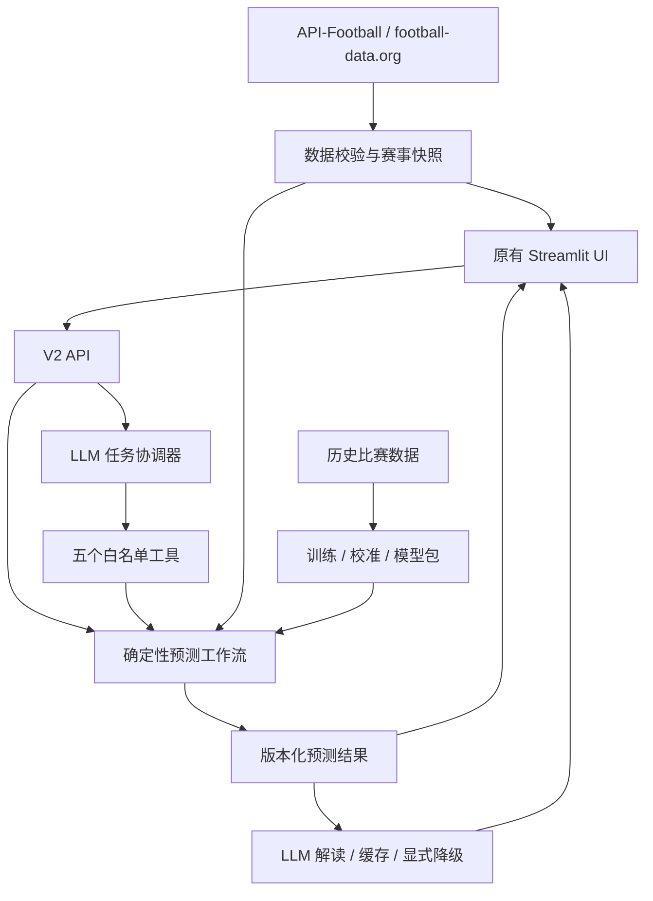

# World Cup Prediction Agent

面向 2026 世界杯的预测与赛事分析应用：用统计模型计算概率，用真实赛事接口更新赛程，用 LLM 规划任务并生成解读。保留深蓝与金色的原有 Streamlit 界面。

> 首页冠军卡片展示 **截至 2026-06-01 的赛前预测回放**，不是当前实际冠军。淘汰赛路线独立读取赛事接口；没有可用数据时显示缺失，不用模拟路线冒充真实赛果。

## 功能与边界

| 模块 | 当前行为 |
| --- | --- |
| 冠军预测 | 固定种子的 Monte Carlo 模拟，输出冠军分布、各轮晋级概率与情景差异 |
| 真实赛程 | API-Football 主来源，football-data.org 备用来源；权限与字段完整性决定可用范围 |
| LLM 协调器 | 查询状态、执行预测、情景分析、历史对比、生成解释五个受限工具 |
| 冠军解读 | 调用配置的 LLM，成功后按结果缓存；失败明确标注模型摘要降级 |
| 原有 UI | 展示赛前预测、真实赛程、解读及情景沙盘，无访客手填密钥 |
| 训练评估 | 历史真实比赛训练、时间切分、概率校准与扩展窗口回测 |

LLM 不负责计算概率，也没有修改模型权重、执行任意代码或 SQL 的工具。解读是基于模型结果的自然语言分析，不是经过验证的因果解释。

## 快速开始

需要 **Python 3.12**。在仓库根目录执行以下命令；当前锁定的 PyTorch 等依赖不能直接用于 Python 3.14。

```bash
python -m venv .venv
# Windows PowerShell: .venv\Scripts\Activate.ps1
# macOS / Linux: source .venv/bin/activate
python -m pip install -r requirements.txt
```

把 [.env.example](.env.example) 复制为 `.env`，设置：

```dotenv
COMBINED_SERVICE=true
ADMIN_API_KEY=replace-with-a-private-random-string-at-least-24-characters
BACKEND_API_KEY=replace-with-the-same-private-random-string
MODEL_BUNDLE_DIR=models/production-v2
SEED_RELEASE=true
ALLOW_DEMO_DATA=false
```

两个密钥必须相同，请自行生成，勿使用示例文本。它们用于服务器内部请求，不发送给浏览器访客。

```bash
python -m streamlit run debug_dashboard.py
```

打开终端打印的网址。合并模式会在同一进程启动仅监听 `127.0.0.1:8765` 的 API。加载随包结果不需要赛事密钥；实时数据和 LLM 功能需要对应服务配置。

## 配置外部服务

| 变量 | 用途 |
| --- | --- |
| `LLM_API_KEY`、`LLM_BASE_URL`、`LLM_MODEL` | OpenAI 兼容的聊天接口；默认地址与模型见示例配置 |
| `API_FOOTBALL` | API-Football 密钥；有密钥不代表订阅包含 2026 赛季 |
| `FOOTBALL_DATA_API` | football-data.org 备用赛事来源 |
| `AUTO_REFRESH_DATA` | 是否启动后台周期刷新 |
| `DATA_REFRESH_INTERVAL_SECONDS` | 刷新间隔，默认 3600 秒 |
| `LLM_MAX_DAILY_CALLS` | LLM 调用预算，默认 200 |
| `COMPUTE_TIMEOUT_SECONDS` | 预测计算预算，完整赛事可配置为 600 |
| `DATABASE_URL` | SQLite 或 PostgreSQL 连接；默认使用本地 SQLite |

本地 dashboard 与后端读取根目录 `.env`，已设置的环境变量优先。Streamlit Cloud 使用 Secrets，值按示例作为顶层字符串配置。不要提交 `.env`、Secrets、数据库或运行缓存。

## 架构



详细职责、兼容代码边界见 [架构说明](docs/architecture.md)。

## 项目结构

```text
main.py                    # 兼容后端入口，保持 main:app 部署命令
debug_dashboard.py         # 原有 UI 实现与兼容入口
app/
  server.py                # FastAPI 应用、生命周期、健康检查
  api/v2.py                # 当前 HTTP 接口
  agents/task_coordinator.py # LLM 工具规划
  core/                    # 配置与运行约束
  data/                    # 数据源获取、规范化与完整性检查
  domain/                  # 输入输出契约
  features/                # 训练与推理共用特征
  models/                  # 模型注册、概率分布与模型实现
  tournament/              # 小组赛排名、签表和赛事模拟
  pipelines/               # 预测与情景工作流
  infrastructure/          # 存储、任务与额度
  explanation/             # LLM 解读和确定性摘要
dashboard/                 # UI 配置、API 客户端、V2 结果适配
data/verified/             # 发布快照与评估报告
models/production-v2/      # 发布模型工件
scripts/                   # 训练、准备数据及历史维护脚本
tests/v2/                  # V2 契约与集成测试
docs/                      # 当前文档及历史资料索引
```

旧版模块仍有回归测试与兼容引用，暂不机械删除；存在某个旧文件不代表它仍在生产请求链中。旧脚本使用前先查 [维护指南](CONTRIBUTING.md)。

## 训练与评估

发布模型使用经过筛选的 14,366 场历史国际比赛，独立测试集 3,398 场，记录的集成 Log Loss 为 0.864782。这不是世界杯冠军命中率，也不证明加入 LLM 提高了准确率。来源、筛选偏差和模型限制见 [模型卡](docs/RELEASE_MODEL_CARD.md)。

```bash
python -m scripts.train_v2 verified-history.json models/v2-candidate --epochs 40
python -m scripts.train_v2 verified-history.json models/v2-backtest --walk-forward-folds 3
```

输入必须满足历史数据契约；输出目录应不存在。不能用测试集挑选模型，不能把模型训练数据当作实时赛事接口。只加载可信模型包。

## 测试与开发

```bash
python -m pip install -r requirements-dev.txt
python -m pytest tests -q
```

静态检查范围与 CI 保持一致，见 [.github/workflows/v2-tests.yml](.github/workflows/v2-tests.yml)。测试通过不等于云端部署或数据权限已通过验收。

## 部署与接口

- [Streamlit 与本地部署](docs/deployment.md)：Python 版本、Secrets、两种运行方式、上线检查。
- [V2 API 索引](docs/api-v2.md)：预测任务、查询结果、LLM 解读与协调器。
- [故障排查](docs/troubleshooting.md)：缺失赛程、LLM 降级、任务忙与依赖失败。
- [完整文档索引](docs/README.md)：当前文档和历史文档的使用范围。

## 已知限制

- 赛事 API 的订阅权限与缺失字段会限制刷新；备用接口并不总能替代完整预测输入。
- 当前加时/点球基线对常规时间打平的双方各给 50% 晋级概率；不是独立拟合的加时模型。
- 首发、伤停和战术信息尚未系统接入训练；LLM 不应虚构这些优势。
- 协调器采用同步请求和全局占用槽，可能返回忙或超时；尚无完善的前端任务恢复体验。
- 合并部署的 SQLite 和解读文件缓存位于本地磁盘，云端重建可能丢失。
- LLM 输出可能误读字段或数字；页面概率卡片以结构化模型结果为准。
