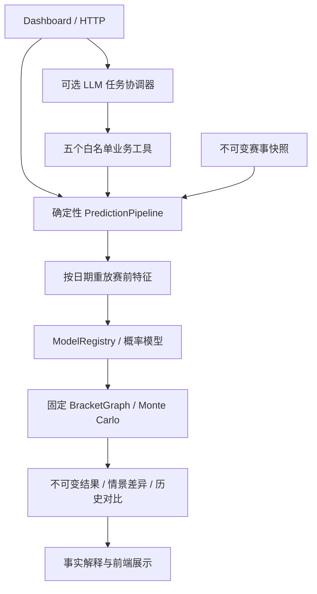

# World Cup Prediction Agent V2

LLM 任务协调器 + 可复现预测工作流。LLM 可查询赛事、启动预测、分析情景、对比历史及生成解释；数值由后端模型和固定签表模拟产生。

**当前状态：实现了固定淘汰赛阶段的完整纵向流程。尚未用已核验真实数据训练、回测或上线验证。** 未配置模型包时使用明确标注的经验 Poisson 基线。仓库原有 CSV、权重和 JSON 不自动进入 V2；原导入脚本会生成合成比赛，不能据此声称真实预测能力。

## 框架



- **数据**：明确来源、赛季、截止时间、90 分钟比分和签表依赖；拒绝重复 ID、非法路径、未处理的进行中比赛。按整日截止保守排除当天和未来赛果。
- **特征**：25 主队 + 25 客队 + 17 差值，再加入中立场标记，共 68 维。训练与推理共用构造器，代理变量不会称作真实射门数据。
- **候选模型**：经验 Poisson、基于赛前 ELO 差与中立场的多分类逻辑回归、XGBoost、普通 MLP。XGBoost 使用原始特征；MLP 的标准化仅训练集拟合且推理只执行一次。
- **模型选择**：时间顺序训练/验证/校准/测试；验证选择单模型或非负加权集成，独立校准集拟合温度，测试集报告 Log Loss、Brier、Accuracy、Macro-F1、可靠性分桶。提供扩展窗口回测。
- **比赛概率**：完整 Poisson 比分矩阵与胜平负边际一致；集成后按结果类别重标比分矩阵。晋级基线为 P(90 分钟胜) + 0.5 × P(平)，加时/点球尚无独立拟合模型。
- **赛事模拟**：固定真实签表，已完赛结果锁定；显式种子，100–20,000 次；统计各轮参赛、决赛配对和完整冠军分布。冠军与 Top5 来自同一分布；代表路径单独展示。
- **运行保障**：鉴权、请求体预算、数据库全局计算槽、幂等、取消、超时与原子落库；数据、模型和签表版本可追溯。API-Football 刷新有每日额度，失败不覆盖旧快照。
- **LLM 边界**：最多 6 次响应、每步一个工具、一次昂贵工作流；无任意代码/SQL/权重修改工具。自然语言解释可能出错，界面另列后端权威数值。LLM 未配置时基础功能仍可使用。

## 本地运行（Python 3.12）

```bash
python -m venv .venv
# 激活虚拟环境后
pip install -r requirements-dev.txt
# 将 .env.example 复制为 .env，设置私人 ADMIN_API_KEY
python -m uvicorn main:app --host 127.0.0.1 --port 8001
# 另一终端，在仓库根目录执行
python -m streamlit run dashboard/app.py
```

通过面板输入操作密钥并上传赛事 JSON。OpenAPI 文档在后端 `/docs`。LLM 另行配置 `LLM_API_KEY / LLM_BASE_URL / LLM_MODEL`，兼容旧 OPENAI 变量；环境变量优先于 .env。

### 无真实数据的演示

```bash
python -m scripts.demo_v2 demo-snapshot.json
```

仅本地将 `ALLOW_DEMO_DATA=true`，导入生成的快照。它是虚构的四队比赛，结果标记 demo；生产环境禁止启用。程序不会用网络当前日期伪造 2026 年赛果。

## API

| 接口 | 行为 |
|---|---|
| GET /api/v2/tournament-state | 查询快照、来源与签表 |
| POST /api/v2/snapshots | 验证、导入不可变快照，需要 X-API-Key |
| POST /api/v2/snapshots/{id}/refresh | 刷新已有 API-Football 比赛 ID，生成新快照，需要密钥 |
| POST /api/v2/predictions | 提交预测，202 返回 job_id，需要密钥 |
| POST /api/v2/scenarios | 提交已知参赛双方的晋级假设，需要密钥 |
| GET /api/v2/jobs/{id} | 查询完成、失败或取消状态 |
| DELETE /api/v2/jobs/{id} | 请求取消，需要密钥 |
| GET /api/v2/results | 查询预测及情景结果 |
| GET /api/v2/results/{id} | 完整运行记录 |
| GET /api/v2/results/{id}/explanation | 无需 LLM 的事实解释 |
| POST /api/v2/compare | 对比 2–5 条同赛季记录 |
| POST /api/v2/coordinator | 五工具 LLM 协调器，需要密钥 |

预测请求：`{"snapshot_id":"64位SHA256","simulation_count":1000,"seed":42}`。可加 `Idempotency-Key` 防重复提交；相同键用于不同参数会失败。情景请求另加 `fixture_id` 与 `forced_winner`，与同种子基线比较。公开读取接口适合公开赛事数据，私有数据部署应在网关增加读取鉴权。

## 训练和回测

输入 JSON 含 `history` 与 `provenance`。每场历史记录必须声明 `score_basis="90_minutes"`。数据管理员必须先核对来源、授权、球队映射、加时和点球语义；`verified` 是管理员确认，不是程序自动认证。

```bash
python -m scripts.train_v2 verified-history.json models/v2-candidate --epochs 40
python -m scripts.train_v2 verified-history.json models/v2-backtest --walk-forward-folds 3
```

输出包含 estimators.joblib、mlp.pt、manifest.json、evaluation.json；回测另含逐折报告。输出目录必须尚不存在。人工审阅真实数据评估后，配置 `MODEL_BUNDLE_DIR` 指向候选包并重启。只加载管理员可信文件，禁止上传任意 joblib。加载核对依赖、特征、来源、权重和文件摘要；预测时间必须晚于所有模型选择/校准数据日期。

## 验证与部署

```bash
pytest tests -q
# 只验证新运行路径
pytest tests/v2 -q
docker compose up --build
```

Compose 仅把后台凭据交给后端；前端用户自行输入密钥。生产需至少 24 字符密钥，禁止 demo 数据与通配 CORS。默认只启用基线，不装载旧权重。Render 蓝图将前后端依赖分开；需要设置实际 BACKEND_URL，LLM/API-Football 凭据可选。尚未执行真实容器构建、PostgreSQL 集成或云部署；不要把配置文件视为部署成功证据。

## 迁移与边界

详见 [V2 迁移与验收](docs/V2_MIGRATION.md)。V1 路由返回 410；旧接口客户端必须升级。新表以 v2_ 开头，不重写旧 JSON、不转换旧预测。旧模型/工具/脚本暂留作迁移参考，已退出生产调用链；旧架构与部署文档只适用于 V1。

尚未实现小组赛积分/同分规则/最佳第三名分配、伤停与首发、实时比赛、独立加时/点球模型、自动收集并核验历史数据。当前概率是模型条件概率；模拟标准误只反映采样误差，不代表真实世界总不确定性。
